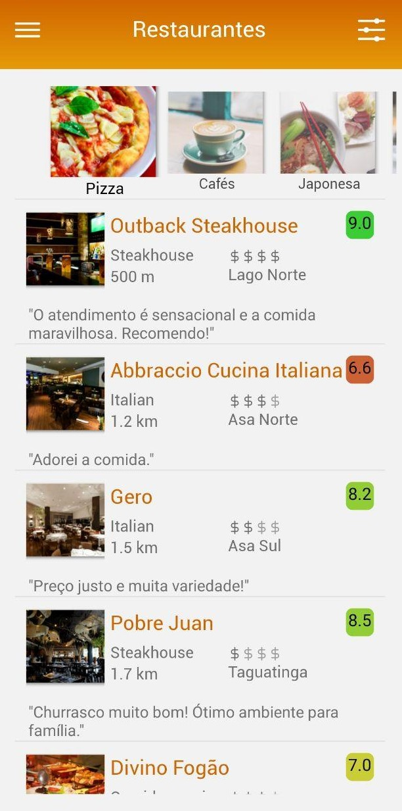

# BuscaRestaurante

This project is the UI implementation in React Native of an App that finds restaurants near you.

## Getting Started

1. Install React Native as described at [https://facebook.github.io/react-native/docs/getting-started.html#content](https://facebook.github.io/react-native/docs/getting-started.html#content)
2. Clone this repository
3. Run `npm install` or `yarn`, and all required components will be installed automatically
4. Run `React-`

## Screenshots

### Project Dependecies
This project uses the following third-party dependecies: 

- [react-native-masked-text](https://github.com/benhurott/react-native-masked-text)
- [react-native-snap-carousel](https://github.com/archriss/react-native-snap-carousel)
- [react-native-vector-icons](https://github.com/oblador/react-native-vector-icons)
- [react-navigation](https://github.com/react-navigation/react-navigation)
- [validator](https://github.com/validatorjs/validator.js?files=1)

### TODOs
- remove the deprecated prop `header: null` of navigationOptions of Login Page
- Add Telefone placeholder at Cadastro Page
- Use redux to save user Email after Login
- improve carousel styling at Main Page
